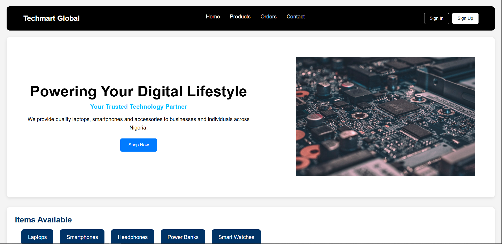
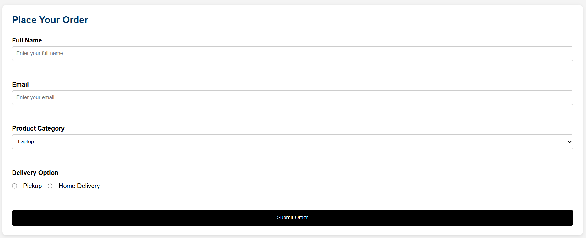
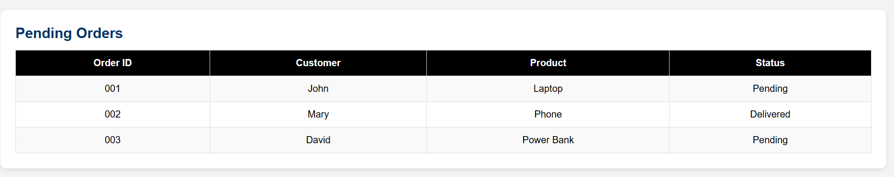

# Techmart Global Landing Page

A simple business landing page built with HTML and CSS for Techmart Global, a technology retail company.

## Project Overview

This project demonstrates the use of fundamental HTML and CSS concepts, including:

- Navigation Bars
- Typography
- Lists
- Forms
- Tables
- Flexbox Layouts
- Responsive Design Principles
- Basic User Interface Styling

The website presents a fictional technology business that sells laptops, smartphones, headphones, power banks, and smart watches.

## Features

- Responsive Navigation Bar
- Hero Section with Image
- Product Showcase Section
- Customer Order Form
- Pending Orders Table
- Modern Card-Based Layout
- Clean and Professional Styling

## Technologies Used

- HTML5
- CSS3

## Live Demo

https://sweet-cranachan-9f3dbb.netlify.app/

## Folder Structure

```text
Techmart-Global/
│
├── index.html
│
└── assets/
    ├── css/
    │   └── style.css
    ├── images/
```

## Learning Objectives

This project was built to practice:

- Semantic HTML
- CSS Styling
- Flexbox
- Forms and Inputs
- Data Presentation with Tables
- Project Organization

## Preview

### Homepage



### Order Form



### Orders Table



## Author

Oyewole Philip

Aspiring Backend Developer & Cloud Engineer
